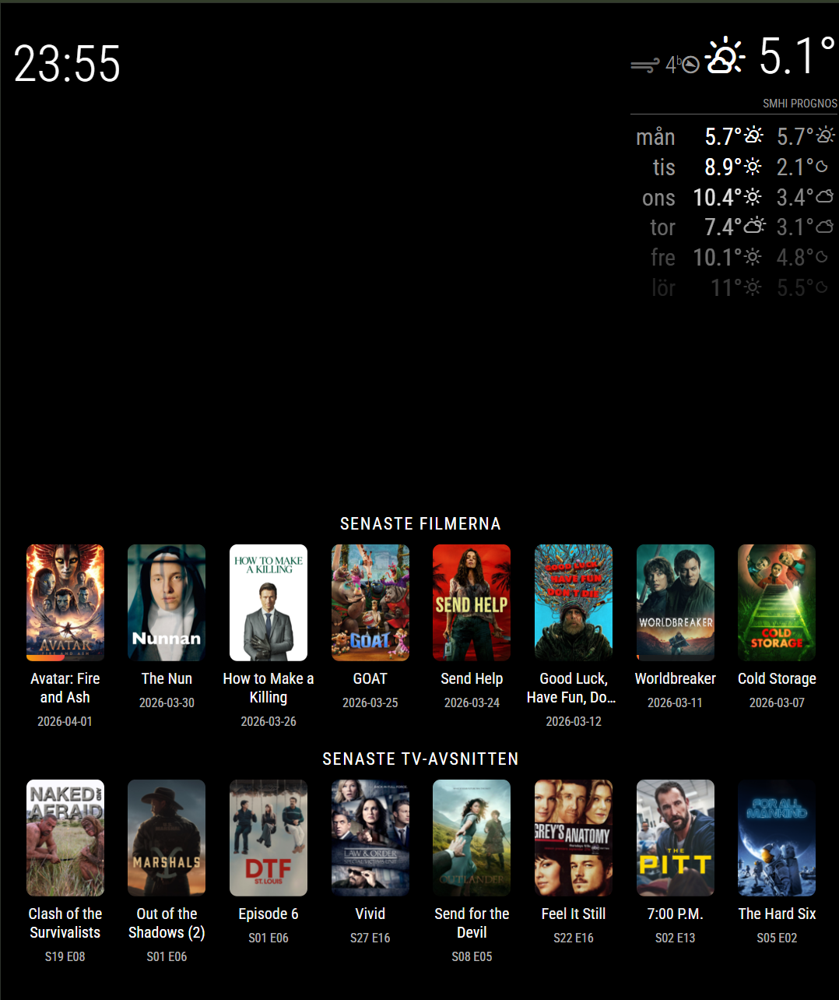
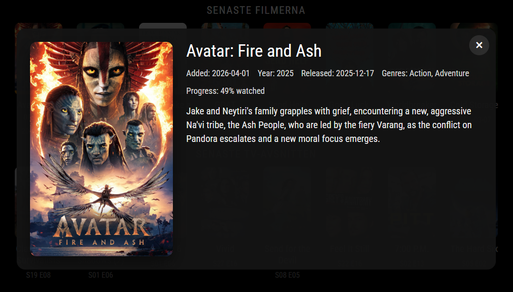

# MMM-TautulliLatest

MagicMirror² module that shows the latest movies and TV episodes from Plex through Tautulli.

Current version: `1.0.1`

## Screenshots

Overview with both rows visible:



Detailed popup view:



## Features

- 8 latest movies in their own row
- 8 latest TV episodes in their own row
- Movies show title, poster, and the date they were added
- TV episodes show episode title, series poster, and `Sxx Exx`
- Posters are fetched through Tautulli's `pms_image_proxy`
- Touch or click a poster to open a larger details view

## Installation

In your terminal, go to your MagicMirror² `modules` folder:

```bash
cd ~/MagicMirror/modules
```

Clone this repository:

```bash
git clone https://github.com/Snille/MMM-TautulliLatest.git
cd MMM-TautulliLatest
```

## Update

To update the module:

```bash
cd ~/MagicMirror/modules/MMM-TautulliLatest
git pull
npm install
```

## Example configuration

```js
{
  module: "MMM-TautulliLatest",
  position: "bottom_bar",
  config: {
    tautulliProtocol: "http",
    tautulliHost: "192.168.1.50",
    tautulliPort: 8181,
    tautulliApiKey: "YOUR_TAUTULLI_API_KEY",
    itemLimit: 8,
    updateInterval: 5 * 60 * 1000,
    posterWidth: 150,
    posterHeight: 225,
    posterMaxWidth: 150,
    posterMaxHeight: 225,
    detailPosterWidth: 400,
    detailPosterHeight: 600,
    showWatchedBadge: true,
    user_id: 123456
  }
}
```

## Optional settings

- `tautulliBasePath`: use this if Tautulli is running behind a subpath
- `movieLibrarySectionId`: limit movies to a specific Plex library
- `showLibrarySectionId`: limit TV content to a specific Plex library
- `movieLabel`: custom heading for the movie row
- `episodeLabel`: custom heading for the TV row
- `hideHeaders`: hide section headings completely
- `updateInterval`: how often the module refreshes data from Tautulli, in milliseconds
- `posterMaxWidth`: maximum poster width in pixels in the layout
- `posterMaxHeight`: maximum poster height in pixels in the layout
- `detailPosterWidth`: poster width in pixels for the details overlay image
- `detailPosterHeight`: poster height in pixels for the details overlay image
- `showWatchedBadge`: show a checkmark badge on items that Plex reports as watched
- `user_id`: Plex user id in Tautulli used to resolve per-user watched status and progress
- `requestTimeout`: API timeout in milliseconds

If you run multiple instances of the module, you can set a different `user_id` on each one to show watched badges and progress bars for different Plex users.

## Tautulli API

This module uses:

- `get_recently_added`
- `pms_image_proxy`

Official reference:

- https://docs.tautulli.com/extending-tautulli/api-reference


